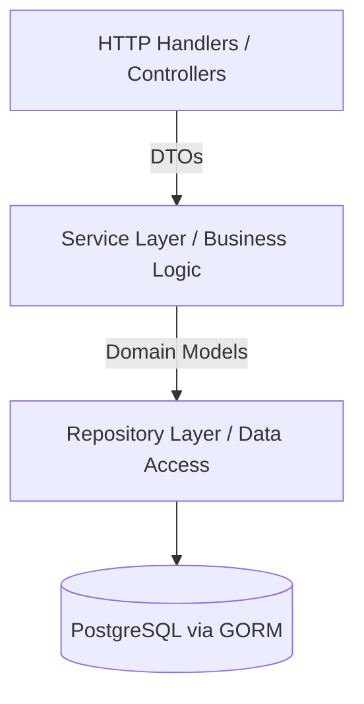

# 📦 DocuVault Backend

The backend of **DocuVault** is a high-performance RESTful API built with **Go (Golang)** and the **Gin** web framework. It handles all business logic, data persistence via **PostgreSQL**, complex authorization checks, and secure document storage.

## 🏗️ Backend Overview & Architecture

The application rigorously follows **Clean Architecture** principles to separate concerns, making the codebase scalable, maintainable, and highly testable.

### Clean Architecture Layers



- **Handlers/Controllers**: Accept HTTP requests, bind JSON/form data to DTOs, and return HTTP responses.
- **Services**: Contain all core business rules. They orchestrate repositories and external services (like SMTP or Storage).
- **Repositories**: Handle direct database interactions using GORM. They abstract SQL queries away from the business logic.

### Dependency Injection
Dependencies are injected explicitly at runtime (typically in `cmd/main.go` or an `app` package). Repositories are injected into Services, and Services are injected into Handlers. This strategy allows for easy mocking during unit testing.

## 📂 Folder Structure

```text
backend/
├── cmd/
│   └── api/                # Main entry point (main.go)
├── internal/
│   ├── config/             # Environment configuration loader
│   ├── database/           # Postgres connection & migrations
│   ├── domain/             # Core business entities (Models)
│   ├── dto/                # Data Transfer Objects for Request/Response
│   ├── handler/            # HTTP endpoints (Controllers)
│   ├── middleware/         # Auth, Logging, CORS middleware
│   ├── repository/         # DB access layer interfaces & implementations
│   ├── routes/             # Gin router setup
│   └── service/            # Business logic implementations
├── pkg/
│   ├── hash/               # Bcrypt & SHA-256 utilities
│   ├── jwt/                # Token generation & validation
│   └── logger/             # Custom structured logging
└── tests/                  # Integration & unit tests
```


## 🔐 Security

### JWT Authentication Flow
1. Client sends credentials to `/auth/login`.
2. Server verifies bcrypt hash.
3. Server generates a signed JWT containing user ID, Role, and Department ID.
4. Client sends JWT in the `Authorization: Bearer <token>` header for subsequent requests.

### Role-Based Access Control (RBAC)
Middleware functions verify user roles before reaching the handler.
- **SUPER_ADMIN**: Full system access.
- **ADMIN**: Manage users, departments, and overarching settings.
- **MANAGER**: Manage documents within their department.
- **EMPLOYEE**: Upload and view documents.
- **VIEWER**: Read-only access to shared documents.

## 📡 API Details

### Versioning Strategy
APIs are versioned via URL path routing (e.g., `/api/v1/documents`). This allows future non-breaking introduction of `v2` endpoints.

### Swagger / OpenAPI Usage
Swagger annotations are utilized throughout the handlers.
- **Generate Docs**: `swag init -g cmd/api/main.go`
- **Access UI**: Visit `http://localhost:8080/swagger/index.html` when running locally.

### Example Request/Response

**Get Document Details**
`GET /api/v1/documents/:id`

**Response:**
```json
{
  "status": "success",
  "data": {
    "id": "123e4567-e89b-12d3-a456-426614174000",
    "title": "Q3 Financial Report",
    "size": 1048576,
    "mime_type": "application/pdf",
    "uploader": {
      "id": "987e6543-e21b-34d1-b654-426614174999",
      "name": "Jane Doe"
    },
    "created_at": "2026-06-11T10:00:00Z"
  }
}
```

## 💻 Local Development & Testing

### Setup
1. Ensure Go 1.22+ and PostgreSQL are installed.
2. Run `go mod tidy` to install dependencies.
3. Setup PostgreSQL and configure the `.env` file.
4. Run the server: `go run cmd/api/main.go`

### Testing Strategy
- **Framework**: Standard Go `testing` package.
- **Assertions**: `github.com/stretchr/testify/assert`
- **Mocking**: `github.com/stretchr/testify/mock` and `vektra/mockery` for auto-generating interface mocks.

**Running Tests:**
```bash
# Run all tests
go test ./... -v

# Run with coverage
go test ./... -coverprofile=coverage.out
go tool cover -html=coverage.out
```

### Docker Setup
A `Dockerfile` is provided for containerization.
```bash
docker build -t docuvault-backend .
docker run -p 8080:8080 --env-file .env docuvault-backend
```
For full stack orchestration, use the `docker-compose.yml` in the root repository.
