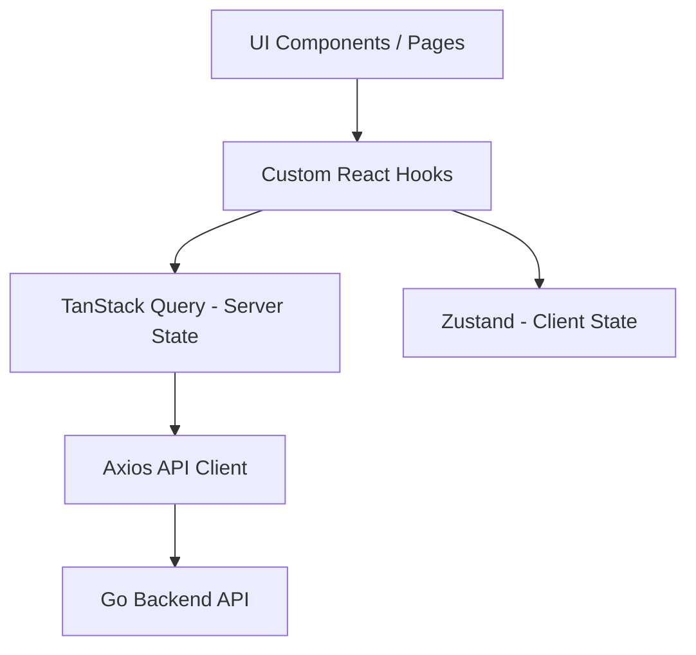

# 🎨 DocuVault Frontend

The frontend of **DocuVault** is a modern, responsive Single Page Application (SPA) built with **React 19**, **TypeScript**, and **Vite**. It provides an intuitive, high-performance user interface for seamless document management.

## 🏗️ Frontend Overview & Architecture

### React Architecture
The application uses a component-based architecture emphasizing reusability and separation of concerns. UI components are strictly separated from data-fetching and state-management logic.



### State Management
- **TanStack Query (React Query)**: Handles all asynchronous server state, data caching, synchronization, and automatic background refetches. It minimizes complex `useEffect` logic.
- **Zustand**: Handles global client state (e.g., current authenticated user session, UI theme, open modal states) with minimal boilerplate.

### Routing
- **React Router**: Client-side routing with protected route wrappers.
- Users attempting to access `/dashboard` without a valid JWT are automatically redirected to `/login`.
- Routes are further protected based on Role-Based Access Control (e.g., only `ADMIN` can access `/users`).

### Form Validation
- **React Hook Form**: Highly performant form state management minimizing unnecessary re-renders.
- **Zod**: Schema-based validation for strict TypeScript type inference and robust client-side error handling before API submission.

## 📂 Folder Structure

```text
frontend/
├── public/                 # Static assets (icons, manifest)
├── src/
│   ├── api/                # Axios instance & API service wrappers
│   ├── assets/             # Images, global CSS
│   ├── components/         # Reusable UI components (Buttons, Modals, Tables)
│   ├── config/             # Environment variables and constants
│   ├── features/           # Feature-specific modules (auth, documents, dashboard)
│   ├── hooks/              # Custom React hooks
│   ├── layouts/            # Page layout wrappers (Sidebar, Header)
│   ├── pages/              # Route entry points
│   ├── store/              # Zustand global state stores
│   ├── types/              # TypeScript interfaces and type definitions
│   └── utils/              # Helper functions, formatting, validation
├── tests/                  # Setup for Vitest and MSW mocks
├── vite.config.ts          # Vite bundler configuration
└── package.json            # Dependencies and scripts
```

## 📡 API Communication Layer

An configured **Axios** instance handles all API requests.
- **Interceptors**: Automatically attach the `Authorization: Bearer <token>` to outbound requests.
- **Error Handling**: Globally intercepts 401 Unauthorized responses to trigger automatic logouts and token expiration notifications.


## 💻 Local Development

### Setup
1. Ensure Node.js 20+ is installed.
2. Install dependencies:
   ```bash
   npm install
   ```
3. Create the `.env` file.
4. Start the Vite development server:
   ```bash
   npm run dev
   ```
5. Access the UI at `http://localhost:5173`.

### Build & Deployment
To create a production-ready optimized build:
```bash
npm run build
```
The output will be in the `dist/` directory, which can be statically hosted on Nginx, Vercel, Netlify, or an AWS S3 bucket.

## 🧪 Testing Strategy

The frontend testing suite ensures high UI reliability and prevents regressions.
- **Vitest**: Extremely fast unit test runner (Vite-native).
- **React Testing Library (RTL)**: Tests components from a user's perspective, ensuring accessibility and correct rendering.
- **Mock Service Worker (MSW)**: Intercepts network requests at the service worker level, allowing realistic API mocking without a running backend.

**Running Tests:**
```bash
# Run tests once
npm run test

# Run tests in watch mode
npm run test:watch

# Generate coverage report
npm run test:coverage
```


